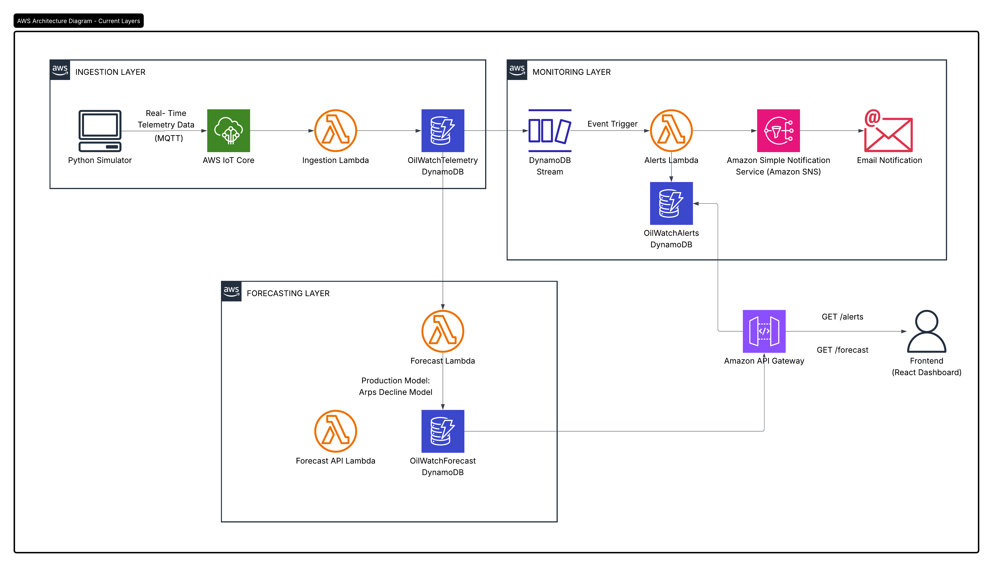
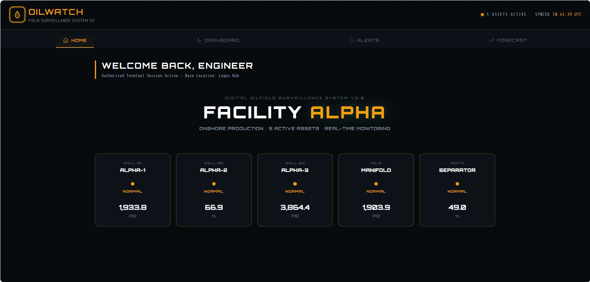
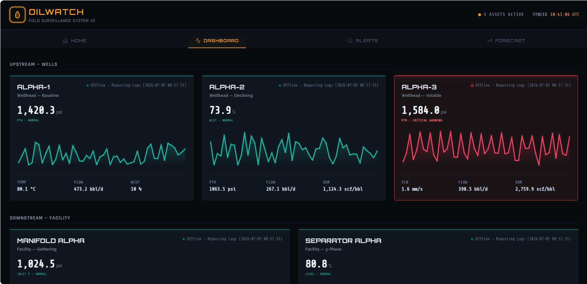
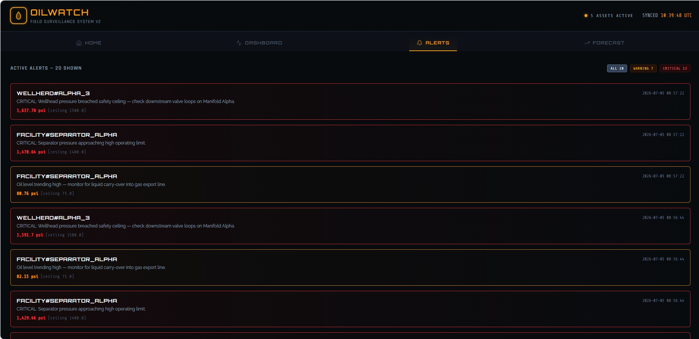
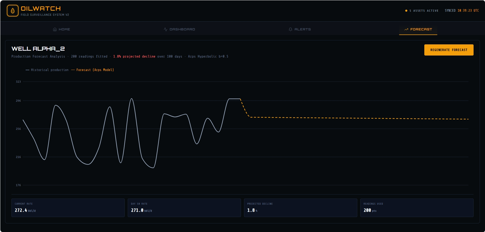

# OilWatch V2.0 🛢️

A serverless, event-driven IoT monitoring platform built on AWS for real-time oilfield telemetry ingestion, anomaly detection, and automated alerting.

---

##  Overview

OilWatch v2.0 simulates how a modern oil and gas production facility monitors asset health using a serverless, event-driven architecture on AWS. It ingests live sensor telemetry from **Facility Alpha**—a simulated five-asset onshore production facility—stores production data, continuously evaluates readings against engineering thresholds, generates real-time alerts for abnormal conditions, and provides on-demand production forecasting using the Arps Hyperbolic Decline Curve model. Unlike traditional systems that rely on manual monitoring or scheduled jobs, OilWatch processes telemetry as it arrives, enabling real-time monitoring and automated decision-making.

---

## Live Demo

Live Demo: https://d2fswpoy9ervv4.cloudfront.net

## Facility Alpha — Asset Profile

| Asset | Type | Identifier | Description |
|-------|------|------------|-------------|
| Alpha-1 | Well | `WELL#ALPHA_1` | Healthy baseline well used as the control asset. |
| Alpha-2 | Well | `WELL#ALPHA_2` | Mature producing well used for production forecasting. |
| Alpha-3 | Well | `WELL#ALPHA_3` | Volatile well used to demonstrate anomaly detection and alerting. |
| Manifold-Alpha | Facility | `FACILITY#MANIFOLD_ALPHA` | Collects production from all three wells. |
| Separator-Alpha | Facility | `FACILITY#SEPARATOR_ALPHA` | Three-phase separator for oil, gas, and water processing. |

---

## Problem Statement

Oil production facilities continuously generate telemetry from wells and production equipment.

Without automated monitoring:
* abnormal pressure can go unnoticed
* equipment failures may be detected too late
* engineers spend time manually reviewing sensor readings
* production downtime becomes more expensive

OilWatch addresses this by building an automated monitoring pipeline capable of ingesting telemetry, evaluating operational conditions, and notifying engineers in real time.

---

## Why Version 2.0?

OilWatch v2.0 builds on the foundation of the original project by introducing a more realistic and scalable telemetry ingestion pipeline.

In Version 1.0, telemetry data was manually ingested into the backend and processed using AWS Lambda, Amazon DynamoDB, DynamoDB Streams, and Amazon SNS to generate email alerts. While this demonstrated the fundamentals of a serverless event-driven architecture, the data ingestion process did not reflect how industrial IoT systems operate.

Version 2.0 introduces AWS IoT Core as the primary telemetry ingestion service, allowing a Python sensor simulator to publish MQTT messages that flow through an end-to-end IoT pipeline. This creates a more authentic monitoring workflow that closely resembles real-world oilfield operations.

The alerting system has also been enhanced. In addition to sending email notifications through Amazon SNS, alerts are now persisted and exposed to the React dashboard, enabling authenticated engineers to view recent alerts alongside live telemetry. This provides both immediate notification and historical visibility into operational events.

### What's New in Version 2.0

* Replaced manual data ingestion with an MQTT-based telemetry pipeline using AWS IoT Core.
* Added a Python sensor simulator to emulate real-time oilfield sensor data.
* Enhanced the alerting system to display recent alerts in the React dashboard in addition to sending email notifications.
* Improved the frontend experience with authenticated access using Amazon Cognito.
* Refined the system architecture with clearly separated ingestion, storage, processing, and alerting layers.
* Built a more scalable, production-inspired serverless IoT monitoring solution.

##  Architecture

The cloud architecture is built across three decoupled, reactive operational layers connected to a global edge presentation layer:

### 1. Ingestion Layer
The Python simulator is the hardware layer. In a real oilfield, physical sensors send this data automatically. The simulator replicates their behaviour — reading five virtual sensors, formatting each as a JSON telemetry packet, and publishing to AWS IoT Core every 5 seconds over TLS.

### 2. Monitoring & Alerting Layer
The Alerts Lambda evaluates every new telemetry record against these thresholds, mirroring the frontend AssetCard.jsx logic exactly. Any new record written to the telemetry database automatically triggers a DynamoDB Stream. The Alerts Lambda consumes these stream shards concurrently. If an anomaly is identified, it maps it simultaneously to two vectors:
- Publishes structured JSON alerts immediately to Amazon SNS, triggering SMS/Email engineer dispatches.
- Commits the historical log to the dedicated OilWatchAlertsTable.

### 3. Production Forecasting Layer
OilWatch uses the Arps hyperbolic decline curve — the petroleum engineering industry standard for production rate forecasting. The Forecast Lambda queries historical data from the OilWatchTelemetry table to execute time-series analytics using the Arps Decline Curve Model.

---

## Tech Stack

- Python
- React
- AWS IoT Core
- AWS Lambda
- Amazon DynamoDB
- DynamoDB Streams
- Amazon SNS
- API Gateway

---

##  AWS Services Used

| Service          | Purpose                        |
| ---------------- | ------------------------------ |
| AWS IoT Core     | Secure MQTT message ingestion  |
| AWS Lambda       | Serverless processing          |
| Amazon DynamoDB  | Telemetry storage              |
| DynamoDB Streams | Event-driven processing        |
| Amazon SNS       | Email notifications            |
| Amazon Cognito   | User authentication            |
| IAM              | Access control and permissions |
| CloudWatch       | Logs and monitoring            |

---

##  Interface Previews

#### Primary Application Workspace (Home)

#### Real-Time Telemetry Dashboard

#### Event-Driven Alerts Logs

#### Reservoir Production Forecasting

---

##  Features

* Real-time telemetry ingestion
* MQTT-based IoT communication
* Event-driven serverless architecture
* Automatic anomaly detection
* Email alert notifications
* Secure user authentication
* Cloud-native AWS deployment
* Fully serverless design
* Production-style monitoring workflow

---

## Learning Objectives

This project demonstrates practical experience with:

* AWS IoT Core
* AWS Lambda
* DynamoDB
* DynamoDB Streams
* Amazon SNS
* Amazon Cognito
* IAM
* Event-driven systems
* Serverless application design
* Real-time data processing

---

## Future Improvements

* Machine learning-based anomaly detection
* Multi-site asset monitoring
* Grafana or Amazon QuickSight dashboards
* SMS and mobile push notifications
* Infrastructure as Code using AWS CDK or Terraform
* Integrate AWS Cognito for role-based access control (RBAC) 

---

#  Author

**Eleja Ololade**

