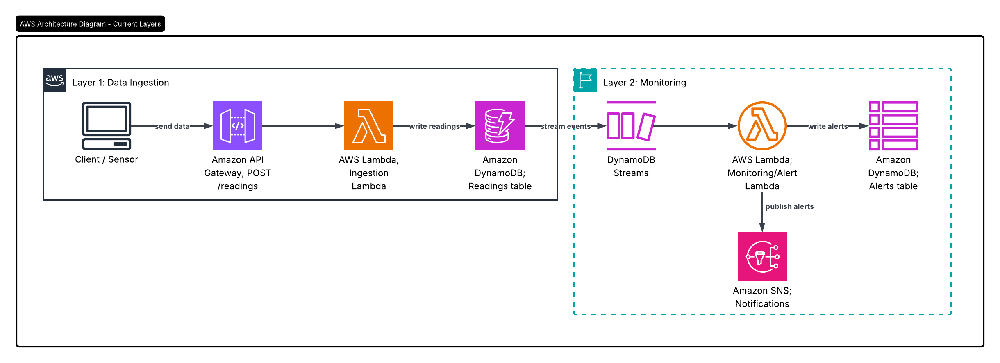
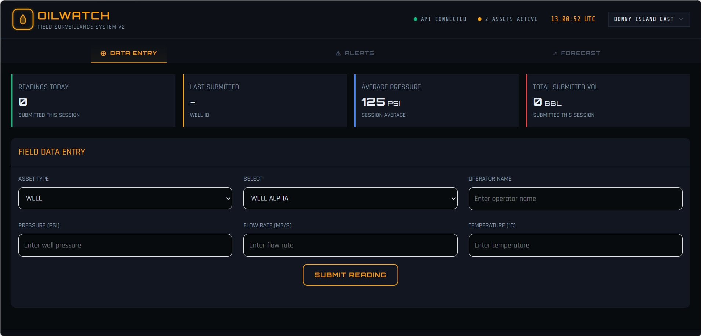
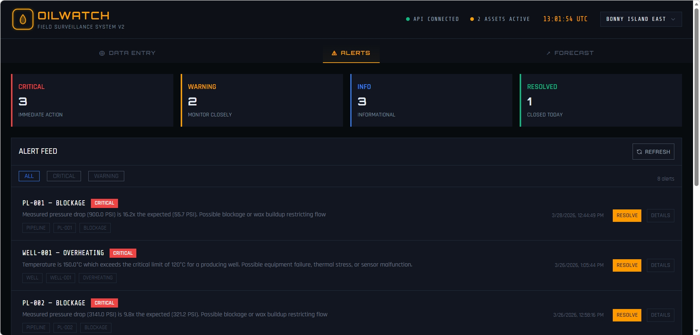
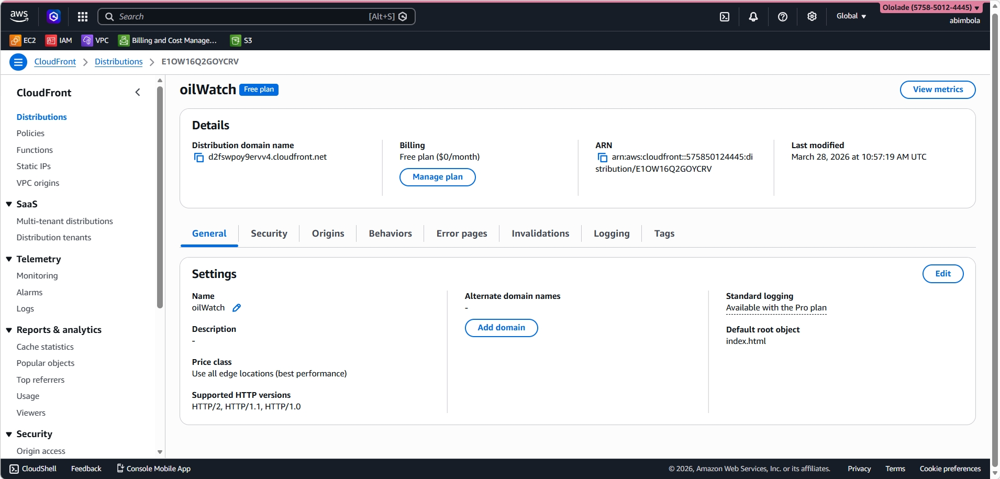
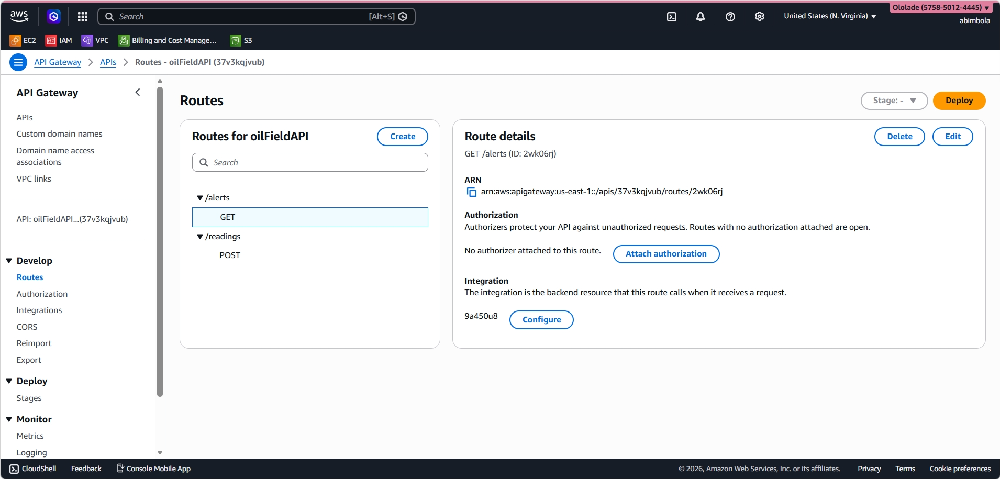

# OilWatch 🛢️

## Overview

A serverless oilfield surveillance system for real-time anomaly detection. OilWatch ingests live sensor data, monitors it continuously, and generates alerts when abnormal conditions are detected.

## Live Demo

Live Demo: https://d2fswpoy9ervv4.cloudfront.net

## Architecture
The system is built using a two-layer architecture:

1️. Data Ingestion Layer

Handles incoming data from oilfield sensors.

Flow:
Client/Sensor → API Gateway (POST /readings) → AWS Lambda → DynamoDB (readings table)

Accepts real-time sensor data
Processes and stores readings in a database
Ensures scalable and serverless ingestion

2️. Monitoring & Alerting Layer

Continuously evaluates incoming data and triggers alerts.

Flow:
DynamoDB Streams → AWS Lambda → DynamoDB (alerts table) → API Gateway (GET /alerts)

Listens to new data via DynamoDB Streams
Detects anomalies (e.g., abnormal pressure/temperature)
Stores alerts for retrieval and analysis

## How it works

* User visits the app via CloudFront (CDN)
* CloudFront serves the frontend from a private S3 bucket
* Sensors or clients send data via `POST /readings`
* API Gateway routes requests to Lambda
* Lambda stores incoming readings in DynamoDB (`readings` table)
* DynamoDB Streams trigger a monitoring Lambda
* Monitoring Lambda analyzes incoming data for anomalies
* Detected anomalies are stored in DynamoDB (`alerts` table)
* Frontend fetches alerts via `GET /alerts` for display

## Tech Stack

* React + Vite
* Tailwind CSS
* Amazon S3
* Amazon CloudFront
* Amazon API Gateway
* AWS Lambda
* Amazon DynamoDB
* DynamoDB Streams

## Screenshots

### Homepage

### Alerts Dashboard

### CloudFront Distribution

### API Gateway

## Features

* Real-time sensor data ingestion
* Event-driven anomaly detection
* Serverless architecture (fully managed AWS services)
* Scalable data pipeline using DynamoDB Streams
* CloudFront + S3 frontend hosting
* REST API for data ingestion and alert retrieval

## Future Improvements

* Add forecasting layer for predictive analytics
* Implement authentication and access control
* Route API through CloudFront to eliminate CORS
* Add real-time updates using WebSockets
* Set up monitoring with CloudWatch Alarms

## 👩🏽‍💻 Author

Eleja Ololade

